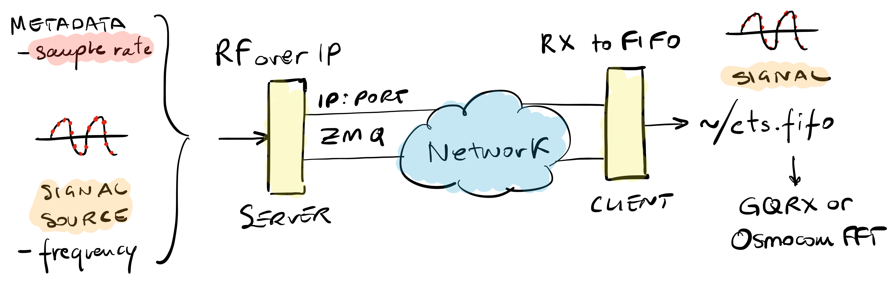
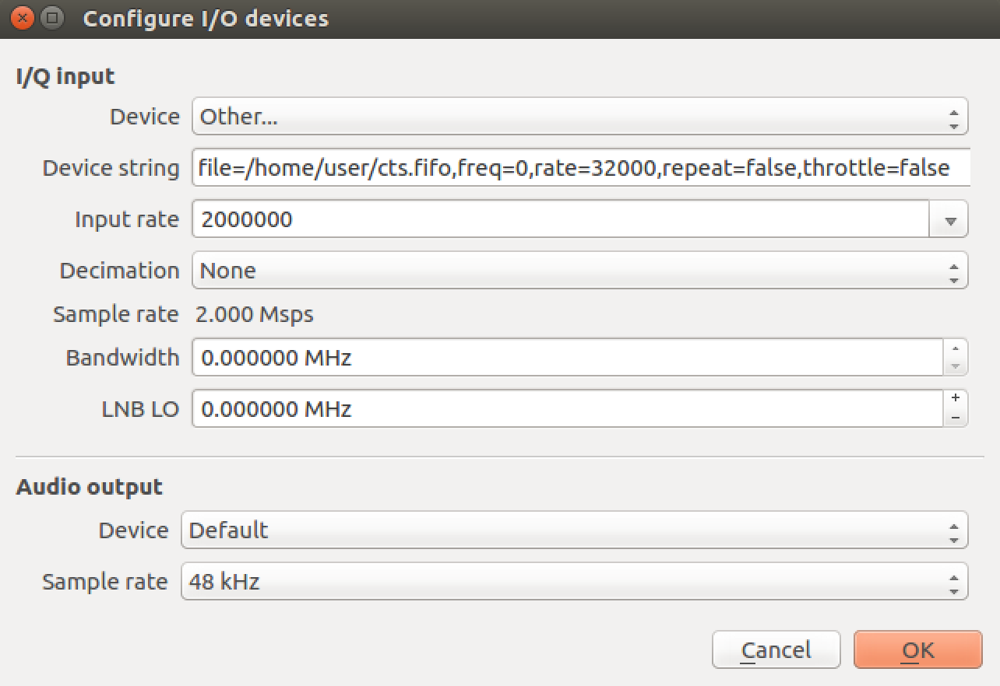

These are client tools used to connect to the [CTS](https://www.trendmicro.com/cts) infrastructure and receive RF data (IQ samples) over IP. They need a working GNU Radio 3.7 installation, they're headless, and are configured via command-line options. We tested them with GNU Radio 3.7.14.
- [RF Signals Over IP](#rf-signals-over-ip)
- [Tuning to a Frequency == Connecting to a Port](#tuning-to-a-frequency--connecting-to-a-port)
- [Getting Started](#getting-started)
- [Start Receiving](#start-receiving)
  - [Example](#example)
- [Receive with SDR Tools](#receive-with-sdr-tools)
  - [Example (GQRX)](#example-gqrx)
  - [Example (Osmocom FFT)](#example-osmocom-fft)
- [Building](#building)
  - [Docker](#docker)
  - [Natively](#natively)
  - [Simple GNURadio Installation on Linux](#simple-gnuradio-installation-on-linux)
- [Use Your Own Tools](#use-your-own-tools)
- [Troubleshooting](#troubleshooting)
  - [No Signal Received?](#no-signal-received)
  - [Read FIFOs from Docker Containers](#read-fifos-from-docker-containers)
  - [Known Build Errors](#known-build-errors)
- [Hacker's Delight: Automatic Sample Rate](#hackers-delight-automatic-sample-rate)
- [Contact Us](#contact-us)

# RF Signals Over IP
In CTS contests radio signals are **streamed from the challenge server** over IP (RFoIP), and **not** over the air with antennae. The use of IP-based transports eliminates the complexity of deploying actual radios and transmitting RF over the air, not to mention per-country regulations about radio transmissions.

In particular, the "raw" RF signals are tunneled via ZeroMQ and can be received with traditional RF tools, as if they were coming from a software-defined radio (SDR). GNURadio, for example, supports [ZeroMQ source blocks](https://wiki.gnuradio.org/index.php/ZMQ_SUB_Message_Source) natively to receive signals as if they were coming from a regular source block. In this way, the entry barrier is fairly low and the players could **focus on the real challenge**: Decoding the signal. For the same reason, for some editions of the contest we provide VMs or Docker images to support the GNURadio toolchain, as setting it up can be a time consuming process and is not relevant to the core of the challenge. Of course, participants are welcome in using their own setup.



# Tuning to a Frequency == Connecting to a Port
You won't need to develop an IP-to-RF translation in order to start receiving signals: **we prepared a tool** that will allow you to receive signals with common RF-analysis software like GQRX and Osmocom-based utilities (e.g., `osmocom_fft`). From there on, you can capture IQ samples to a file as if you were using an SDR.

All you have to do is to **choose the frequency** you want to tune to, and
the RFoIP server will send you the right metadata to adjust the sample rate
automatically (see below). We'll provide you the frequency of the first
signal to kickstart the game.

# Getting Started
```bash
$ cd cts-cli/
$ python rx_to_fifo.py --help
Tags to Var imported
FIFO already exists (not creating): /path/to/cts.fifo
Usage: rx_to_fifo.py: [options]

Options:
  -h, --help            show this help message and exit
  --rx-frequency=RX_FREQUENCY
                        Set RX Frequency [default=900000000]
  --server-ip=SERVER_IP
                        Set Server IP [default=127.0.0.1]
  --server-port-base=SERVER_PORT_BASE
                        Set Server Port Base [default=10000]
  --throttle=THROTTLE   Set Throttle [default=1]
  --zmq-rx-timeout=ZMQ_RX_TIMEOUT
                        Set ZMQ RX Timeout [default=100]
```

# Start Receiving
When using `rx_to_fifo.py`, frequency tuning is performed automatically (by connecting to the RFoIP server on the right port) and any downstream tool or process that has settings for tuning will have no effect on the delivered signal.

```bash
$ cd cts-cli/
$ python rx_to_fifo.py                              \
  --server-ip=<this is given by the organizers>     \
  --rx-frequency=<each challenge has its own frequency>
Tags to Var imported
Tags to Var initialized

Created FIFO: /path/to/cts.fifo
IMPORTANT: Before you can see the source sample rate, you must start consuming samples from the FIFO
...
```

Check that you can receive at least one sample:

```bash
$ cat /path/to/cts.fifo > /dev/null
```

And you should now see the original signal's sample rate reported on the standard output:

```bash
...continued from above...

rx_rate = 128000.0
```

**IMPORTANT:** Each signal has it's own sample rate! Always check the reported sample rate before you start working on a signal. You can kill and restart the `rx_to_fifo.py` script as many times as you need (especially if it appears dead).

## Example
To summarize, if you want to tune to 434.7MHz you **must**:

1. run `rx_to_fifo.py --rx-frequency 434700000 --server-ip=<IP>`,
2. point your standard receiver tool (e.g., GQRX) to the FIFO file,
3. use the receiver tool (e.g., GQRX) to tune to 434.7MHz

To be crystal clear, the following **will not work**:

1. run `rx_to_fifo.py --rx-frequency 434500000 --server-ip=<IP>` (notice the **5** instead of the **7**),
2. point your standard receiver tool (e.g., GQRX) to the FIFO file,
3. use the receiver tool (e.g., GQRX) to tune to 434.5MHz **+ 0.2MHz**

This implies that if you need to **re-tune to a different frequency**, you'll have to **kill any `rx_to_fifo.py` process before starting a new one**.

When started, the console may not show the sample rate until the FIFO is actually accessed. The **sample rate** may not update until a valid connection is made to the server, samples are delivered and read from the FIFO. If you're curious, these are [GNU Radio Stream Tags](https://wiki.gnuradio.org/index.php/Stream_Tags).

# Receive with SDR Tools
Now you can consume RF data (IQ samples) from the FIFO. For example, with GQRX you can use the following device string:

```
file=/path/to/cts.fifo,freq=0,rate=<sample rate>,repeat=false,throttle=false
```

Again, you can keep a local copy of a the IQ samples of the signal by redirecting the output of the FIFO to your favorite file.

## Example (GQRX)
1. start GQRX (e.g., `$ gqrx -e`),
2. under "Device:" choose "Other"
3. under "Device string:", put: `file=/home/user/cts.fifo,freq=0,rate=32000,repeat=false,throttle=false`
4. click "OK"
5. choose the frequency you want to inspect,
6. hit the play button,
7. you should see some activity on the spectrum,
8. and continue as usual.



## Example (Osmocom FFT)
Just run:

```bash
$ osmocom_fft 
    -F \
    --args="file=/home/user/cts.fifo,freq=0,rate=32000,repeat=false,throttle=false"
```

If this doesn't work for you, because gr-fosphor requires hardware acceleration, just drop the `-F` switch.

# Building
If you want to build the tools yourself, we recommend using our Docker images. However, if you're familiar with GNU Radio and have a working 3.7 installation, you can build them natively.

## Docker
```bash
$ cd cts-cli/
$ ./docker-run.sh 'make all'
```

## Natively
```bash
$ cd cts-cli/
$ make all
```

## Simple GNURadio Installation on Linux
If you run Linux and just want to install GNU Radio 3.7, we recomend using the following PPAs to get the basic tools installed (this is what we use in our Docker images).

```bash
$ sudo add-apt-repository -y ppa:bladerf/bladerf \
    && add-apt-repository -y ppa:myriadrf/drivers \
    && add-apt-repository -y ppa:myriadrf/gnuradio

$ sudo apt-get update \
    && apt-get install -y \
        gr-osmosdr \
        gnuradio
```

# Use Your Own Tools
If `rx_to_fifo.py` does not work for your situation, sample data can be saved
to a file within GNU Radio via the RF Over IP Source
(`rf_over_ip_source.grc`) block, or just copied from the FIFO and processed
statically by any tool.

Take a look at the `rx_to_fifo.grc` flowgraph as an example.

# Troubleshooting
## No Signal Received?
If no samples can be read from the FIFO, it is possible that there is no
connection to the server. In this case, check network connectivity, check that
the `server_ip = <SERVER IP>` in the `config/cts_contestant.cfg` file is
correct, terminate any process accessing the FIFO (don't feel bad if you need
to use `kill -9`, we all did it at least once in our lives), restart
`rx_to_fifo.py`, and then restart any downstream tool accessing the FIFO.

Occasionally, when starting or stopping a tool that accesses the FIFO, the following error:

```
thread[thread-per-block[7]: <block file_sink (12)>]: file_sink write failed with error 27
```

In this case simply kill and restart the script. Only one instance
`rx_to_fifo.py` should be run at a time. Multiple readers simultaneously
reading from the FIFO will result in corrupted data being read.

## Read FIFOs from Docker Containers
IQ samples are written to a named pipe (the FIFO file), which is an OS-dependent beast. In theory, you could run the 'rx_to_fifo.py' receiver within a Docker container and consume IQ-samples from *outside* the Docker container. However, this will work only if the host operating system is the same of the container operating system (i.e., Linux). We tried with a macOS host: didn't work!

```bash
$ ./docker-run.sh 'python rx_to_fifo.py                              \
  --server-ip=<this is given by the organizers>     \
  --rx-frequency=<each challenge has its own frequency>'
```

And then you can use `./cts.fifo` as any other named pipe (FIFO), e.g.
```bash
$ dd if=cts.fifo of=samples.raw bs=2048 count=1000
```

This will not work on any non-Linux host OS (because FIFOs are OS-specific) but a trick would be to use a second container that proxies that FIFO to a TCP socket (using `socat`), expose that port to the host, and then use `socat` on the host to re-proxy from the exposed port back to a file. Not clean, but should work.

Alternatively, simply use `dd` or `cat` from within docker:

```bash
$ ./docker-run.sh 'dd if=cts.fifo of=samples.raw bs=2048 count=1000'
```

The resulting `samples.raw` file can then be read directly into tools like URH.

## Known Build Errors
You may get compilation errors, which actually don't block the build process. 

Should you encounter **build errors on GNURadio 3.8**, please [check this out](https://github.com/gnuradio/gnuradio/issues/2763), or just use one of the provided VMs (they're tested). The cause is unknown, but a workaround exists (comment out `global_blocks_path` in `~/.gnuradio/grc.conf`).

Other errors could be ignored: what really matters is the final `rx_to_fifo.py` file. If that's there and it loads without errors, you're good to go.

```bash
$ ls -lah *.py
ls: cannot access '*.py': No such file or directory

$ make
rm -rf *.pyc
rm -rf epy_*.py
for grc in tags_to_vars rx_to_fifo; do \
  rm -rf $grc.py; \
done
rm -rf build
rm -rf __pycache__
for grc in tags_to_vars rx_to_fifo; do \
  grcc -d ./ $grc.grc; \
done
Unhandled exception in thread started by <bound method Thread.__bootstrap of <Thread(Thread-1, stopped daemon 139634459854592)>>
Traceback (most recent call last):
  File "/usr/lib/python2.7/threading.py", line 774, in __bootstrap
    self.__bootstrap_inner()
  File "/usr/lib/python2.7/threading.py", line 814, in __bootstrap_inner
    (self.name, _format_exc()))
  File "/usr/lib/python2.7/traceback.py", line 241, in format_exc
    etype, value, tb = sys.exc_info()
AttributeError: 'NoneType' object has no attribute 'exc_info'
FIFO already exists: /home/user/cts.fifo
FIFO already exists: /home/user/cts.fifo
>>> Warning: This flow graph may not have flow control: no audio or RF hardware blocks found. Add a Misc->Throttle block to your flow graph to avoid CPU congestion.
Unhandled exception in thread started by <bound method Thread.__bootstrap of <Thread(Thread-1, stopped daemon 139966222206720)>>
Traceback (most recent call last):
  File "/usr/lib/python2.7/threading.py", line 774, in __bootstrap
    self.__bootstrap_inner()
  File "/usr/lib/python2.7/threading.py", line 814, in __bootstrap_inner
    (self.name, _format_exc()))
  File "/usr/lib/python2.7/traceback.py", line 241, in format_exc
    etype, value, tb = sys.exc_info()
AttributeError: 'NoneType' object has no attribute 'exc_info'

$ ls -lah *.py
-rw-rw-r-- 1 user user   93 Oct 15 15:19 epy_chdir.py
-rw-rw-r-- 1 user user  384 Oct 15 15:19 epy_mkfifo.py
-rw-rw-r-- 1 user user 1.6K Oct 15 15:18 epy_tags_to_vars.py
-rwxrwxr-- 1 user user  17K Oct 15 15:19 rx_to_fifo.py
```

# Hacker's Delight: Automatic Sample Rate
Sample rates are set by the server on a per-signal basis. The RFoIP server
automatically informs the client (e.g., `rx_to_fifo.py`) about the original
sample rate of the tuned signal, so that the IP-to-RF translation is precise
and lossless. Obviously, clients can resample or process the signal as they see
fit.

Note that some GNU Radio blocks do not support the run-time adjustment of sample
rates (indicated by block parameters that are not underlined), so the best
strategy to address this is to tune to a signal, examine the returned sample
rate and then set the sample rate of the tuned signal as the default sample
rate in your flow graph or tool.

If you're curious about how this has been achieved, the sample rate indication
works via the transmission of a [GNU Radio
tag](https://wiki.gnuradio.org/index.php/Stream_Tags) attached to the tuned
sample stream from the client to the server.

The tag is received by the RF Over IP Source (`rf_over_ip_source.grc`)
block and the variable `samp_rate` is automatically updated in the parent flow
graph. Individual signals have fixed sample rates that do not change, though
the `samp_rate` variable may initially change upon flow graph start if the
default value of `samp_rate` differs from the tuned signal.

Sample rate throttling is performed on both the server and client sides of the
IP link by default. This does not by default create a two-clock problem as the
IP link between server and client is asynchronous. If a hardware block is used
on the RX side or throttling interferes with a particular tool, it can be
disabled on the RX side by passing a 0 to the throttle parameter of the RF Over
IP Source block.

You may notice the following warning message when using the RFoIP infrastructure:

```
Warning: the blks2.selector block is deprecated.
```

This is not a concern as the selector block is not being used to change
signal paths dynamically, but only once upon flow graph startup. The selector
block was deprecated by the GNURadio project as it is not sample-accurate
when switching during runtime in that an unknown amount of samples are
dropped during switching and its operation can be confusing to users.

# Contact Us

Should you encounter blocking errors, just open an issue or [contact us](https://trendmicro.com/cts/).
